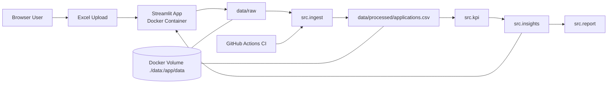

# Job Application Analytics

End-to-End Analytics Pipeline zur Analyse des Bewerbungsprozesses.
Fokus auf Data Ingestion, Data Quality, KPI-Design, Insight-Engine,
CI/CD und containerisiertem Deployment auf Raspberry Pi.

## Showcase Features
- Ingestion & Schema-Normalisierung (Synonym-Mapping, Trim, Typkonvertierung)
- Data Quality Layer (Required Columns, Date Checks, Duplicates, Status Validation)
- KPI Layer mit Funnel-Conversion & Ghosting-Metriken
- Insight-Engine mit automatischen Business-Callouts
- Markdown Report Export
- Robuste Fallback-Charts
- Docker Deployment (Raspi) mit persistentem Volume
- GitHub Actions CI (Compile + Tests)

## Architektur


Hinweis: `docs/architecture.png` ist aktuell ein Platzhalter. Source of Truth ist `docs/architecture.mmd`.



## Datenfluss
1. Excel wird hochgeladen (oder in `data/raw` abgelegt).
2. Ingestion normalisiert + validiert Daten.
3. Processed CSV wird erzeugt.
4. KPI- und Insight-Layer speisen das Dashboard.

## Datenformat & Schema (Data Contract)
- Das Dashboard erwartet eine strukturierte Excel-Datei.
- Spalten werden in der Ingestion normalisiert (inkl. Synonyme und Typen).
- Fehlende Pflichtspalten fuehren zu einem DQ-FAIL.

| Spalte | Typ | Pflicht | Beschreibung |
| --- | --- | --- | --- |
| bewerbungsdatum | Datum | Ja | Datum der Bewerbung |
| unternehmen | String | Ja | Firmenname |
| stelle | String | Ja | Position |
| quelle | String | Ja | Bewerbungsquelle |
| status | String | Ja | Prozessstatus |
| arbeitsmodell | String | Nein | remote/hybrid/onsite |
| ranking_score | Float | Nein | Eigene Bewertung (0-1) |
| wartezeit_tage | Integer | Nein | Wartezeit |

Wichtige Regeln:
- Erlaubte Statuswerte (Muster): `absage`, `abgelehnt`, `interview`, `gespraech`, `angebot`, `offer`, `zusage`, `eingangsbestaetigung`, `antwort`, `rueckmeldung`.
- Unbekannte Statuswerte fuehren zu `WARN` (Pipeline laeuft weiter).
- Missing Required Columns fuehren zu `FAIL` (Pipeline stoppt).

Eine Beispielstruktur befindet sich unter `docs/example_schema.csv`.

## Data Quality Checks
- Required Column Check
- Date Validation (keine Future-Dates)
- Duplicate Detection
- Status Validation

Verhalten:
- `FAIL` stoppt die Pipeline.
- `WARN` protokolliert einen Hinweis, Verarbeitung laeuft weiter.

## Reproduzierbarkeit
- CI Workflow: `.github/workflows/ci.yml`
- Compile-Checks: `python -m compileall src dashboard`
- Low-friction Tests (ohne pytest): `tests/test_kpi_flags.py`, `tests/test_rate_by_source.py`, `tests/test_quality.py`

## Lokale Nutzung
```bash
python -m src.ingest
streamlit run dashboard/app.py
```

## Docker (Raspberry Pi)
```bash
docker compose up -d --build
```

Zugriff:
`http://<raspi-ip>:8501`

## Report-Export
```bash
python -m src.report
```
Ausgabe:
`reports/insights.md`

## Projektstruktur
- `dashboard/`: Streamlit-App
- `src/`: Ingestion, DQ, KPI, Insights, Report
- `data/raw/`: Excel-Uploads
- `data/processed/`: aufbereitete CSV (`applications.csv`)
- `docs/`: Architektur, Schema-Beispiel, KPI-Doku
- `reports/`: generierte Reports
- `tests/`: testbare Skripte via `python tests/<datei>.py`
- `.github/workflows/`: CI-Pipeline

## Roadmap
- PostgreSQL Backend
- Authentifizierung / Basic Auth
- Scheduled Ingestion
- PDF Export
- Multi-User Tracking
